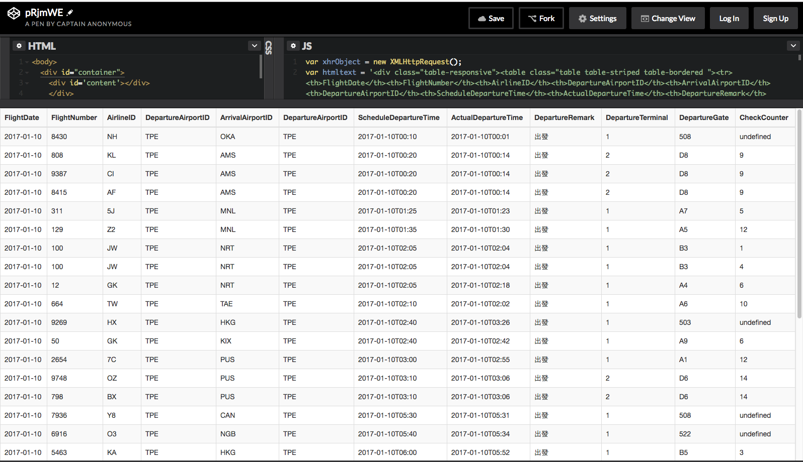
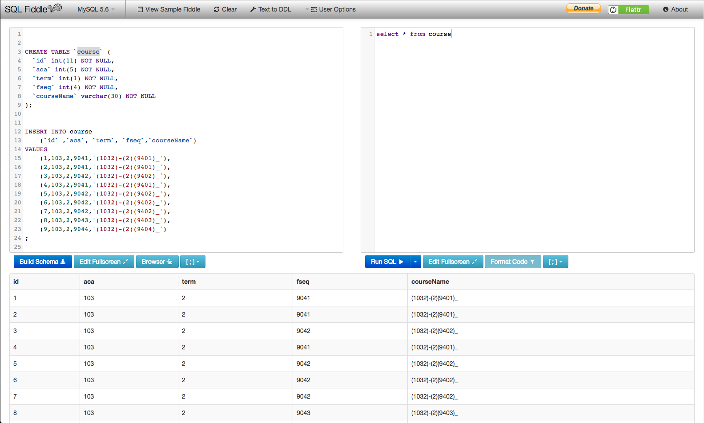

# 國立屏東科技大學-教學卓越計畫專任程式設計開發人員筆試考題

## 線上測驗

1. 請參考[公共運輸整合資訊流通服務平臺]所提供API,進行API串接實作,並利用[線上編輯器]將查詢之API資料轉換成Html表格,
並呈現於瀏覽器,本測驗可以open book

2. 請按照資料表規格,試著寫出找出課程筆數大於2的資料庫語法。

## 範例圖片

1. API串接

2. SQL查詢

## 相關連結

- [公共運輸整合資訊流通服務平臺](https://ptx.transportdata.tw/PTX)
- [線上編輯器](https://codepen.io/pen/)
- [SQL線上編輯器](http://sqlfiddle.com/#!9/d42da/4)